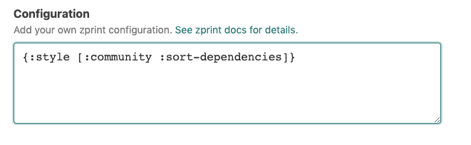

# `@atomist/zprint-skill`

<!---atomist-skill-readme:start--->

Format your Clojure and ClojureScript code using [zprint][zprint], get pull requests or commits with fixes.

# What it's useful for

The zprint tool can help your team use consistent formatting for all Clojure and ClojureScript files.
This skill watches all your team' commits to GitHub, and uses zprint to ensure that the code follows consistent formatting guidelines.
If possibles fixes are detected, the skill will send you those fixes in a pull request, or by commiting directly to a branch.

There are already great ways to use zprint from your local development environment.
However, this skill validates and fixes unformatted commits that have still managed to slip through cracks.
If you never push unformatted commits, then you won't notice this skill is even running.

It does not rely on any project configuration in the repository (e.g it doesn't matter whether you're using
deps.edn, or leiningen project.clj, or boot). It runs whenever commits are pushed to GitHub.

Code reviews are so much better when your team is using the same formatting.  
And obviously, a huge thanks to [zprint][zprint]!

# Before you get started

1.  **GitHub**

The **GitHub** integration must be configured in order to use this skill.
At least one repository must be selected.

# How to configure

1.  **Choose how to apply formatting changes**

    Choose one of these options:

    * `Commit to default branch only` - only format the default branch, and push fixes directly to the default branch
    * `Commit to any branch` - push formatting fixes to all branches
    * `Raise pull request for default branch only; commit to other branches` - formatting fixes for the default branch
       should raise PRs. Fixes to other branches should commit directly to the branch.
    * `Raise pull request for any branch` - always use Pull Requests.

    

2.  **Specify formatting rules configuration**

    Optionally, customize the configuration that the `zprint` library will use by adding your custom rules here. The
    zprint documentation providers several [`:style`s that you can choose from](https://github.com/kkinnear/zprint/blob/master/doc/reference.md#available-styles). Choosing one
    of these styles is a great way to standardize formatting across all of your Clojure projects.

    

3.  **Select repositories**

    By default, this skill will be enabled for all repositories in all organizations you have connected. To restrict
    the organizations or specific repositories on which the skill will run, you can explicitly
    choose organization(s) and repositories.

    Either select all, if all your repositories should participate, or choose a subset of repositories that should
    stay formatted. This skill will take no action on repositories that do not contain `.clj`, `.cljs`, or `cljc` files.

    

# How to Use

1. **Configure the skill as described above**

1. **Commit and push your code changes**

1. **Enjoy automatic formatting!**

To create feature requests or bug reports, create an [issue in the repository for this skill](https://github.com/atomist-skills/zprint-skill/issues).
See the [code](https://github.com/atomist-skills/zprint-skill) for the skill.

[zprint]: https://github.com/kkinnear/zprint

<!---atomist-skill-readme:end--->

---

Created by [Atomist][atomist].
Need Help? [Join our Slack workspace][slack].

[atomist]: https://atomist.com/ "Atomist - How Teams Deliver Software"
[slack]: https://join.atomist.com/ "Atomist Community Slack"
